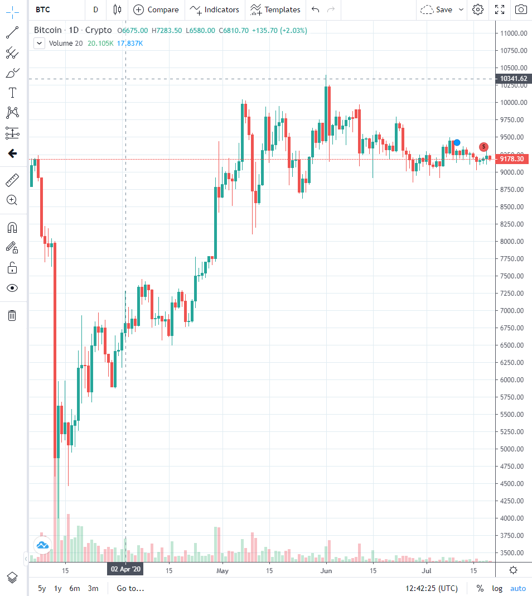
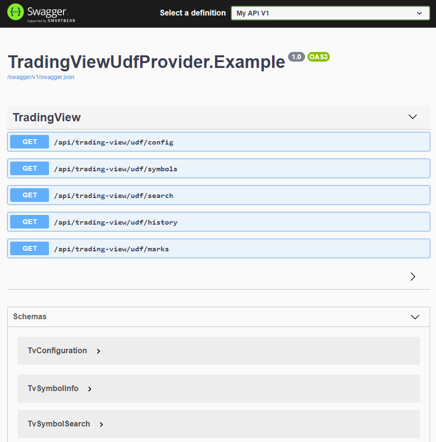

# TradingView UDF provider
[](https://travis-ci.org/Marfusios/bitfinex-client-websocket) [](https://badge.fury.io/nu/TradingView.Udf.Provider) [](https://www.nuget.org/packages/TradingView.Udf.Provider)

This is a C# implementation of the TradingView UDF data provider (via HTTP API). 
It's a backend server application that provides data for standalone charting library. 

Info: https://www.tradingview.com/HTML5-stock-forex-bitcoin-charting-library/?feature=technical-analysis-charts 

Docs: https://github.com/tradingview/charting_library/wiki/UDF

[Releases and breaking changes](https://github.com/Marfusios/tradingview-udf-provider/releases)

### License: 
    MIT

### Features

* installation via NuGet ([TradingView.Udf.Provider](https://www.nuget.org/packages/TradingView.Udf.Provider))
* automatically integrates into ASP.NET Core
* targeting .NET Standard 2.0 (.NET Core, Linux/MacOS compatible)

### Usage

1. Create a new ASP.NET Core solution
2. Reference nuget [TradingView.Udf.Provider](https://www.nuget.org/packages/TradingView.Udf.Provider)
3. In Startup.cs call:
```csharp
public void ConfigureServices(IServiceCollection services)
{
    // setup default JSON serializer to ignore null values
    // important!
    services.AddControllers()
            .AddJsonOptions(opts =>
            {
                opts.JsonSerializerOptions.IgnoreNullValues = true;
            });

    ...

    // register TradingView provider with your custom data class
    services.AddTradingViewProvider<MyTvProvider>();
}
public void Configure(IApplicationBuilder app, IWebHostEnvironment env)
{
    ...
    // optional TradingView provider settings
    app.UseTradingViewProvider(new TradingViewSettings());
}
```
4. Create a new class `MyTvProvider` that implements interface `ITradingViewProvider` [link](src/TradingViewUdfProvider/ITradingViewProvider.cs)
5. Everything ready, you can now connect TradingView chart library with this backend server, example: [index.html](test/TradingViewUdfProvider.Example/Views/Gui/Index.cshtml)


Full usage example [link](test/TradingViewUdfProvider.Example)

### API coverage

| UDF                    |   Implemented  |
|------------------------|:--------------:|
| GET /config            |  ✔            |
| GET /symbol_info?group |                |
| GET /symbols?symbol    |  ✔            |
| GET /search            |  ✔            |
| GET /history           |  ✔            |
| GET /marks             |  ✔            |
| GET /timescale_marks   |                |
| GET /time              |                |
| GET /quotes            |                |

### Screens

 

 


**Pull Requests are welcome!**

### Available for help
I do consulting, please don't hesitate to contact me if you have a custom solution you would like me to implement ([web](http://mkotas.cz/), 
<m@mkotas.cz>)

Donations gratefully accepted.
* [](https://en.cryptobadges.io/donate/1HfxKZhvm68qK3gE8bJAdDBWkcZ2AFs9pw)
* [](https://en.cryptobadges.io/donate/LftdENE8DTbLpV6RZLKLdzYzVU82E6dz4W)
* [](https://en.cryptobadges.io/donate/0xb9637c56b307f24372cdcebd208c0679d4e48a47)
